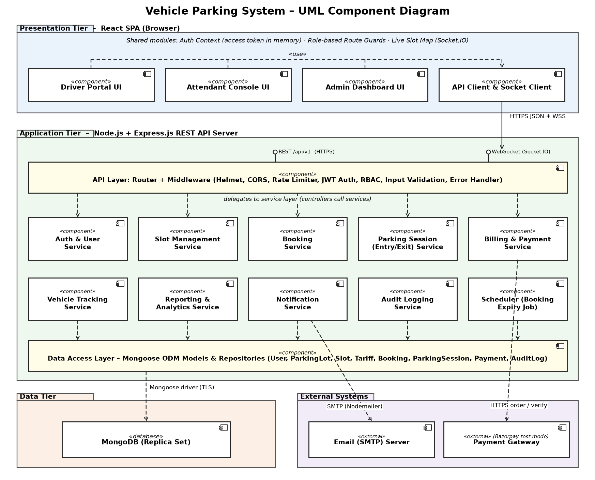
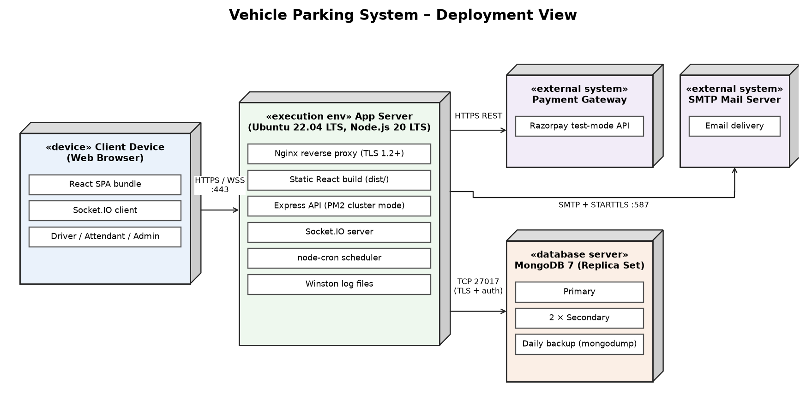

# Vehicle Parking System — Team 10

**Software Engineering (UE24CS341A) Mini-Project · Semester 5 · Section F · PES University, Bengaluru**

A web-based system for managing parking slots and tracking vehicles. Drivers see live slot availability and reserve slots. Parking attendants check vehicles in and out, and the system calculates the fee and records the payment. Administrators manage lots, slots and tariffs, and view occupancy and revenue reports.

| | |
|---|---|
| **Team #** | 10 (Section F) |
| **Problem statement** | Vehicle Parking System – a system for managing parking slots and vehicle tracking |
| **Tech stack** | MERN – MongoDB, Express.js, React.js, Node.js (+ Socket.IO for live slot updates) |

## Team

| Name | SRN |
|---|---|
| Pandi Snehitha | PES1UG24CS315 |
| Pramiti Ragavendra Udupa | PES1UG24CS331 |
| Ramitha R | PES1UG24CS368 |

## Part-1 Deliverables (due 07-10-2026)

| # | Deliverable | Location | Status |
|---|---|---|---|
| 1 | Software Requirements Specification (IEEE format) | [`docs/SRS/`](docs/SRS/) | Completed by team – to be uploaded |
| 2 | Software Test Plan (IEEE format, with test cases) | [`docs/TestPlan/`](docs/TestPlan/) | In progress |
| 3 | Software Architecture & Design Specification (SAD) | [`docs/SAD/`](docs/SAD/) | ✅ v1.0 uploaded |
| 4 | Implementation start + sprint activity | [`docs/Sprint-Plan.md`](docs/Sprint-Plan.md) | Sprint 1 planned |

## SAD at a glance

- **Architecture:** Layered three-tier (React SPA → Express REST API → MongoDB), with the routes, controllers, services and repositories kept in separate layers. Socket.IO sends live slot-status updates to the browser.
- **Components:** Auth & User, Slot Management, Booking, Parking Session (entry/exit), Billing & Payment, Vehicle Tracking, Reporting, Notification, Audit Logging, Scheduler.
- **Security:** bcrypt password hashing, JWT and refresh tokens, role-based access control (Driver / Attendant / Admin), input validation, rate limiting and TLS. Threats are analysed with a STRIDE model.

| Component diagram | Deployment view |
|---|---|
|  |  |

Sequence diagrams: [Reserve a slot](docs/diagrams/seq_booking.png) · [Vehicle entry / exit & payment](docs/diagrams/seq_entry_exit.png) · [Login](docs/diagrams/seq_login.png)

## Repository structure

```
.
├── README.md
├── docs/
│   ├── SRS/                  # Software Requirements Specification
│   ├── SAD/                  # Software Architecture & Design Specification (PDF + DOCX)
│   ├── TestPlan/             # Software Test Plan + test cases
│   ├── Sprint-Plan.md        # Sprint backlog for implementation
│   ├── diagrams/             # UML component, deployment and sequence diagrams (PNG)
│   │   └── source/           # Python scripts that regenerate the diagrams and the SAD .docx
│   └── course-material/      # Templates and instructions given by the course
├── client/                   # React front end   (added in Sprint 1)
└── server/                   # Express back end  (added in Sprint 1)
```

## Regenerating the diagrams / SAD

```bash
pip install matplotlib python-docx
python docs/diagrams/source/generate_diagrams.py
python docs/diagrams/source/build_sad_docx.py
```
